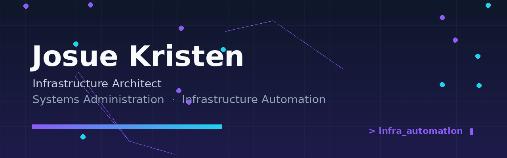

<p align="center">
  
</p>

<h1 align="center">Josue Kristen</h1>

<p align="center">
  <strong>Infrastructure Architect · Systems Administration · Infrastructure Automation</strong>
</p>

<p align="center">
  <a href="https://linkedin.com/in/dirbys-kristen-novoa-931866178">
    
  </a>
  <a href="mailto:jkristen0416@gmail.com">
    
  </a>
  
</p>

Arquitecto de infraestructura y administrador de sistemas con más de 13 años
de experiencia en tecnología y más de 8 años trabajando con infraestructura
crítica.

Actualmente me desempeño en arquitectura de infraestructura, participando en
el diseño, estandarización y evolución de entornos empresariales, con foco en
disponibilidad, seguridad, automatización y continuidad operativa.

Mi experiencia incluye Windows Server, Active Directory, VMware, Proxmox,
monitoreo, backups y automatización mediante PowerShell y Python.

## Especialización

- Windows Server y Active Directory
- VMware, Proxmox y virtualización
- PowerShell y Python para automatización
- Monitoreo, alertas y análisis de causa raíz
- Backups, recuperación y continuidad operativa
- Administración de infraestructura física y virtual
- Documentación técnica y procedimientos operativos
- Homelab e integración de herramientas de IA

## Experiencia destacada

- 13+ años de experiencia en tecnología.
- 8+ años trabajando con infraestructura crítica.
- Experiencia operativa en un entorno global de más de 22.000 servidores.
- Administración y resolución de incidentes P1, P2 y P3.
- Experiencia en soporte N1, N2 y N3.
- Liderazgo y coordinación de equipos de soporte.
- Automatización de tareas administrativas y controles operativos.
- Documentación de procedimientos, arquitecturas y soluciones.

## Trayectoria

```text
  2013 - 2016  Especialista en Soporte Técnico
               Racks, cableado, soporte remoto
  2016 - 2019  Coordinador de Mesa de Ayuda
               Liderazgo de equipos, N1/N2/N3, WSUS
  2020 - 2022  Soporte N3 · Data Center
               VMware, monitoreo, backups
  2022 - 2025  Lead Systems Administrator
               22K+ servidores globales, incidentes P1/P2/P3
  2025 - Actualidad  Infrastructure Architect — Empresa confidencial
               Diseño, estandarización y evolución de infraestructura empresarial
```

## Tecnologías

| Área | Tecnologías |
| --- | --- |
| Sistemas | Windows Server, Linux |
| Directorio | Active Directory, Group Policy, WSUS |
| Virtualización | VMware vSphere, Proxmox, Hyper-V |
| Automatización | PowerShell, Python, Bash |
| Monitoreo | Zabbix, monitoreo de infraestructura |
| Backups | Veeam, OpenMediaVault |
| Redes | MikroTik, DNS, DHCP, VLAN, Tailscale, Pi-hole |
| Contenedores | Docker, LXC |
| Cloud | AWS |
| Documentación | Markdown, Obsidian, diagramas técnicos |

## Proyectos personales y laboratorio

Fuera del entorno profesional, desarrollo herramientas de automatización,
monitoreo y documentación técnica utilizando entornos controlados y datos
anonimizados.

### [infra-automation-tools](https://github.com/jkristen0416-prog/infra-automation-tools)

Colección de herramientas orientadas a controles operativos, auditorías y
automatización de infraestructura. Documentación completa por herramienta y
validación automática con GitHub Actions.

- [`Get-ADHealthReport.ps1`](https://github.com/jkristen0416-prog/infra-automation-tools/blob/main/scripts/Get-ADHealthReport.ps1) — reporte de salud de Active Directory (DCs, replicación, cuentas, expiración de contraseñas, último backup).
- [`Get-VMwareSnapshotAudit.ps1`](https://github.com/jkristen0416-prog/infra-automation-tools/blob/main/scripts/Get-VMwareSnapshotAudit.ps1) — auditoría de snapshots antiguos en vSphere con umbral configurable.
- [`Test-BackupFreshness.ps1`](https://github.com/jkristen0416-prog/infra-automation-tools/blob/main/scripts/Test-BackupFreshness.ps1) — verificación de vigencia de backups con exit codes para monitoreo.

Exportan resultados a CSV y JSON, y están pensados para ejecución programada
e integración con sistemas de monitoreo.

### [gifs-repo](https://github.com/jkristen0416-prog/gifs-repo)

Documentación visual y anonimizada de arquitecturas, procedimientos y flujos
operativos mediante diagramas y animaciones técnicas.

> Todo ejemplo público utiliza datos ficticios y excluye direcciones IP,
> dominios, credenciales y nombres de clientes reales.

## Principios operativos

- **Estabilidad primero:** ningún cambio sin validación, respaldo y plan de reversión.
- **Documentación:** si un procedimiento es importante, debe quedar registrado.
- **Causa raíz:** resolver el origen del problema, no solamente sus síntomas.
- **Automatización:** una tarea repetitiva debe convertirse en un proceso controlado y reproducible.
- **Seguridad:** ninguna demostración pública debe exponer información sensible.

## Certificaciones y formación

### Certificaciones oficiales

| Certificación | Año | Verificación |
| --- | --- | --- |
| VMware VCP-DCV vSphere 7 | 2024 | [Portal oficial de verificación VMware](https://www.vmware.com/learn/certification/verify.html) |
| AWS Cloud Practitioner | 2023 | [Verificación oficial de credenciales AWS](https://aws.amazon.com/verification/) |

### Formación y cursos

| Curso | Año | Plataforma |
| --- | --- | --- |
| VMware vSphere 7: vCenter & Identity | 2024 | [VMware Learning](https://www.vmware.com/learn.html) |
| Windows Server 2022: Active Directory Basics | 2024 | [Microsoft Learn](https://learn.microsoft.com/credentials/) |
| Monitoring in DevOps | 2024 | Formación en monitoreo y observabilidad |

> **Credenciales verificables disponibles durante el proceso de selección.**
> Las certificaciones oficiales (VCP-DCV, AWS) están separadas de los cursos
> de formación para reflejar su distinto alcance.

## Actualmente explorando

- IA aplicada a operaciones de infraestructura.
- Automatización asistida por agentes.
- Observabilidad y enriquecimiento automático de alertas.
- Administración reproducible de entornos de laboratorio.
- Integración de PowerShell, Python y APIs de infraestructura.

## Contacto

- LinkedIn: [dirbys-kristen-novoa-931866178](https://linkedin.com/in/dirbys-kristen-novoa-931866178)
- Correo: [jkristen0416@gmail.com](mailto:jkristen0416@gmail.com)
- Ubicación: Buenos Aires, Argentina
